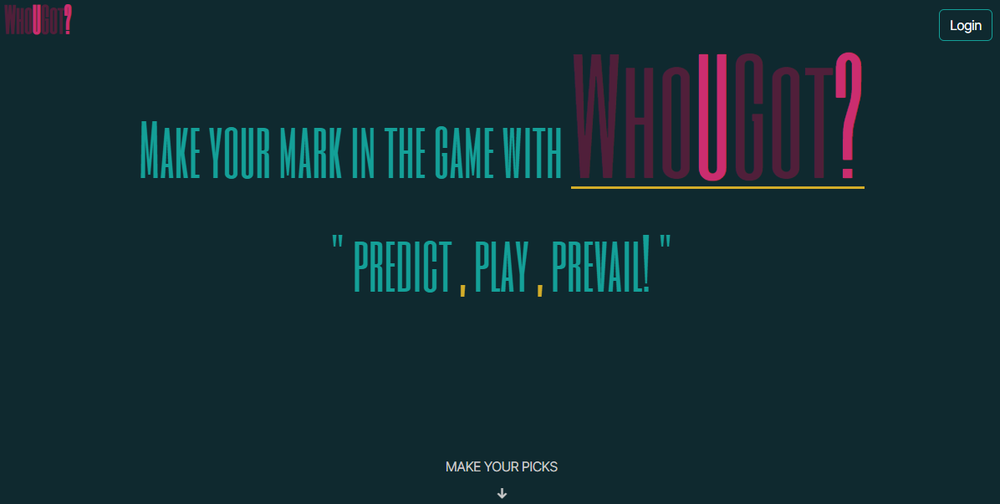

# React Native Sports Pick App



This application is a game that allows users to predict winners for upcoming sports events.

## Table of Contents

## Description

User picks are stored in a MongoDB database. The application uses a third party ESPN API to check each user pick against the actual sports event winner. If a user pick corresponds with the winner of the event, the pick is stored as a winning pick. User standings are calculated and compared against other users.

Note: The application follows the same structure as the third party ESPN API data. As a result, events are organized first by sport and then by league.

## Technologies

- node.js
- MongoDb
- [Mongoose](https://mongoosejs.com/)
- [Epress NPM package](https://www.npmjs.com/package/express)
- ReactJS
- GSAP
- Bootstrap

## Site Images

## Dependencies

## Installation

- Install node.js to computer, if not already installed.

  - Node.js can be installed from [here](https://nodejs.org/en/).

- Copy all application files to local machine.

- Open main directory and install all dependencies. These installations are accomplished by performing the following command:

```bash
npm i
```

## Status

The NFL pipeline was the first one set up and is fully operational. The application will continually be updated to include other sports leagues.

Fully operational sport/leagues pipelines:

- football -> NFL

Sport/Leagues pipelines in progress:

- football -> CFL
- basketball -> NBA, WNBA

## Contributors

[Ashley Stith, CEO and Lead Developer of A To Zion Web Design, LLC](mailto:ashley.stith@atozionwebdesign.com).

## Deployment

Check out the live application and other recent projects at http://www.atozionwebdesign.com
